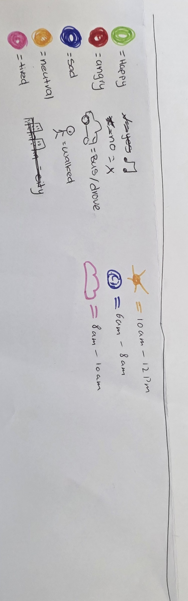
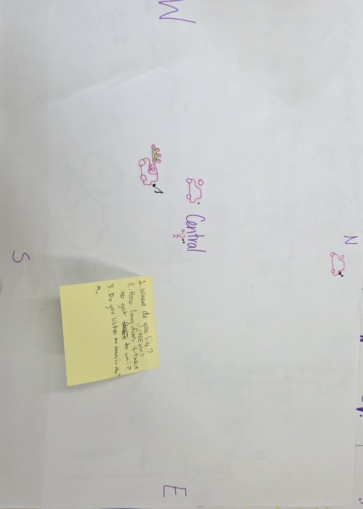
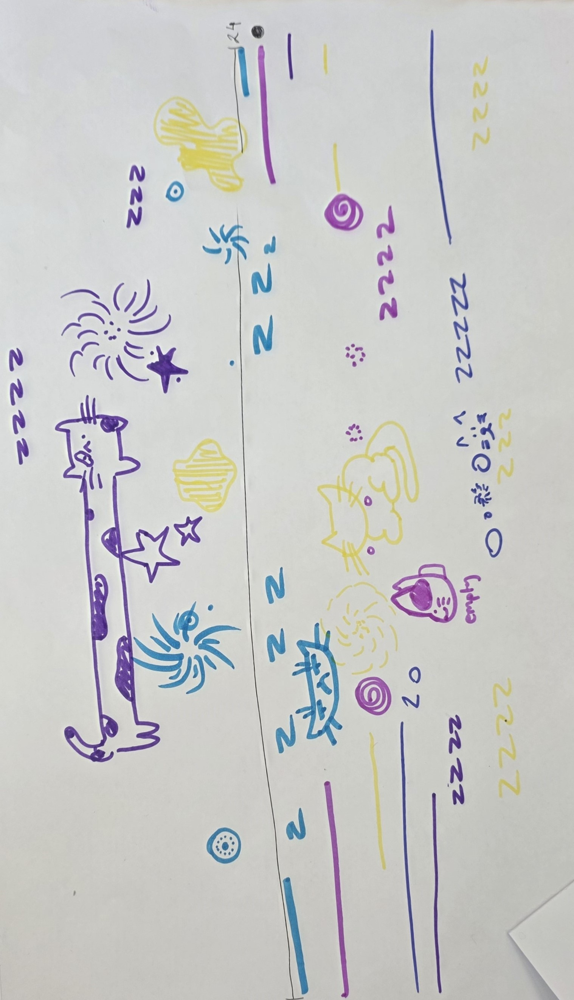
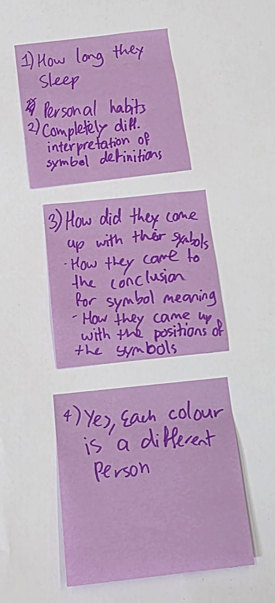
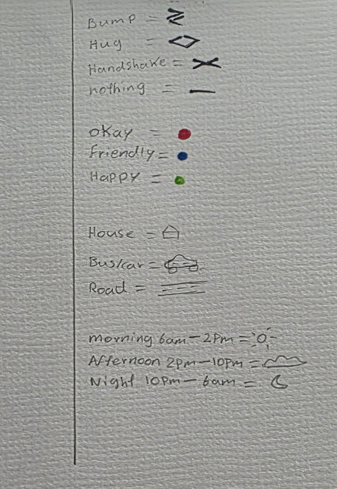
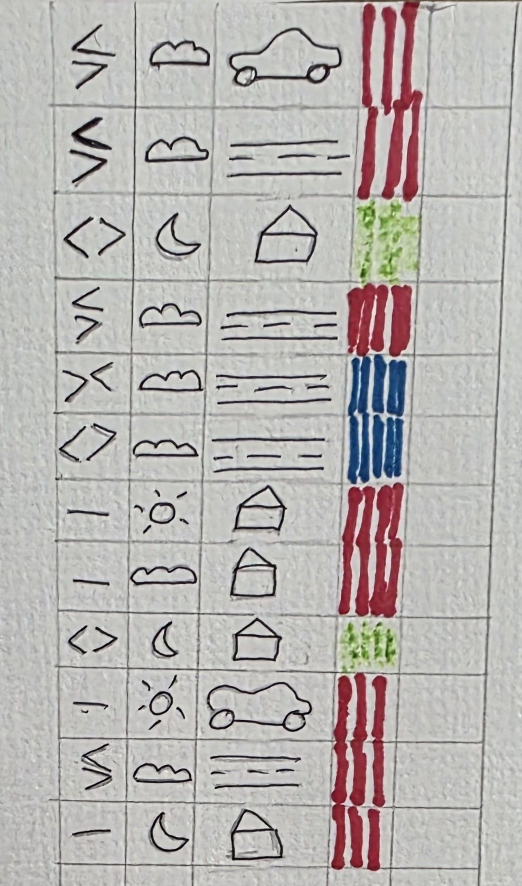

# Week 01

[← Back to Home](../index.md)

## Documentation 

## Experiment 1: Data Drawings

**Overview**
*This experiment involves collecting personal data within a small group and transforming it into a hand-drawn data visualisation, creating a “group portrait” that others can interpret to uncover insights about the people behind the data.*

**Step 1: Collect**
*As a group, we tried to come up with questions that felt personal but are also general. For example, "did you listen to music on your way today?" is an example of how seemingly general things that we do every day becomes important personal data. We wanted to also wanted to have a variety of elements that we can use for our data so we tried to come up with questions that varied in context.*
*Questions Note*

**Step 2: Visualise**
*Visualising the data required us to not only think about our response but also how it can be represented so  it is clear to others that there is a variation within our data to help them decode every pattern. This was a challenge for us as one of our responses to 'how we were feeling' was all the same and therefore the person viewing the data would assume it is a fixed element and and would be difficult to decode. So to solve this we added a variant to make it clearer.*
*legend of our portrait*

*Data Portrait*

**Step 3: Decode**

*Decoding the other group's portrait more difficult than expected. However, it gave a new perspective in how visual elements can be represented differently and how it challenges the viewer with more complexity making it more fun.* 
*Group Swap visual data drawings*

## Independent Study: Data Portrait

**Overview**
We are asked to collect data of an aspect in our everyday life and transform it into a visual portrait. 

*What did you choose to track, and why?*
*I chose to track the physical contact I had with other people throughout the day over four days. I selected this because it is easy to remember, which helps improve the accuracy of the data when recording it later. Additionally, physical contact is a meaningful way to observe the social interactions and patterns in my daily life.* 

*What was it like to collect and visualise this data?*
*Collecting data regularly during the day seemed difficult at first so I limited it to three physical touches everyday that stand out to me and can be recorded. If I was outside for example I would use my phone to record some of the data for better accuracy and finish later. Visualising the data is a challenging part as I had to make every aspect of the recorded experience clear. Including symbols, colour and shapes but it was also a fun process.*

*What did you notice that you wouldn't have otherwise?*
*Through tracking my physical contacts, I noticed patterns in how often and where these interactions occurred. For example I noticed that many of these interactions happened accidentally or very casually. I was also more aware of my emotional response to these interactions. I noticed that I tend to avoid physical contact as much as possible. These happen with strangers on buses or with crowds mostly but i realised it's quite unavoidable sometimes. This is something I wouldn't notice in my daily life, but during this experiment it became more obvious to me.*

*What choices did you make for your data collection? What does it emphasise? What is left out?*
*I chose to also track the time of day these events happened, the place, and how I felt when they occurred. This emphasised a broader perspective with every interaction I had, such as the environment I'm in or the people I'm with. It also created a pattern that allowed me to see how my interactions depended a lot on my emotional state which would have created a bias at certain times. The data I recorded may have also left out important details such as the intensity of each contact or my emotional state before every interaction. Also, recording only three interactions a day meant that there were small interactions that I did not remember or consider to record.*

*How does this exercise relate to data humanism and the *Dear Data* project?*
*This exercise relates to data humanism by focusing on subjective and personal experiences rather than just numerical data. As mentioned in Giorgia Lupi’s  Ted Talk “Data is just a tool we use to see through things”. Similarly with the Dear Data project, both see data not just through numerals, graphs and charts but as things in our reality that we experience. They visualise data in a creative and meaningful process.*

*Any other reflections?*
*This experiment helped me realise that data can be easily collected by anyone. However, it can also be very much influenced by memory or personal bias. I like the idea of simply tracking repetitive or small behaviours for a small amount of time can help you visualise a pattern and give us a wider perspective of our lives. I would love to try this with other niche daily behaviours and see what comes up.*

*Data collection during the week for experiment two*

## AI Usage Statement
*This work was completed without the use of AI.*