# Week 02

[← Back to Home](../index.md)

## Documentation 

## Overview
In the week 2 activities and experiments we have started to explore more advanced digital tools. We have used p5.js to learn how to use code to transform sketches and ideas into interactive graphics. 

## Activity 1: Drawing with Code

`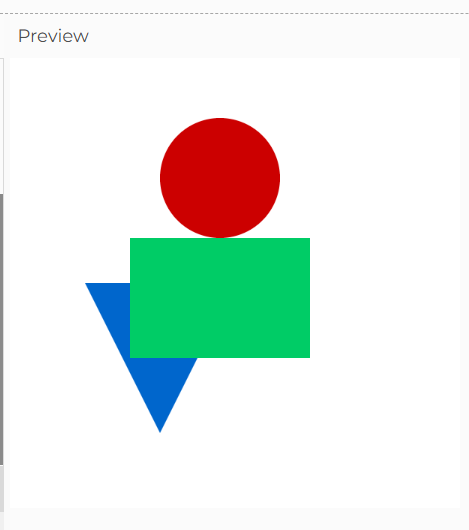
*In the first activities I was briefly able to learn the setup of p5js. I leared about the setup functions and function draws. I was able to use the p5js reference page to create differnt shapes and elements on the canvas. This allowed me to explore more features such as colour,strokes, size and position. These tools are great to start with for beginners. It helped me get good strong understanding of how the code works and how to be able to visually interpret it onto the canvas.*

`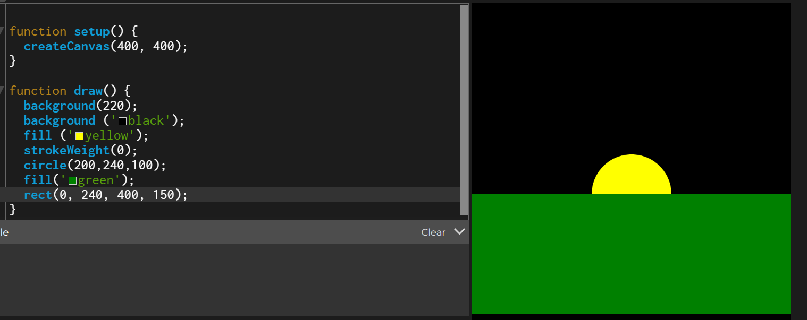
*Recreated this sunset image by visually interpreting the refrence photo given into the code while also using the p5js reference page to asssist me.*

## Activity 2: Make an Interactive Sketch

**A slider that controls the size or position of a shape**
`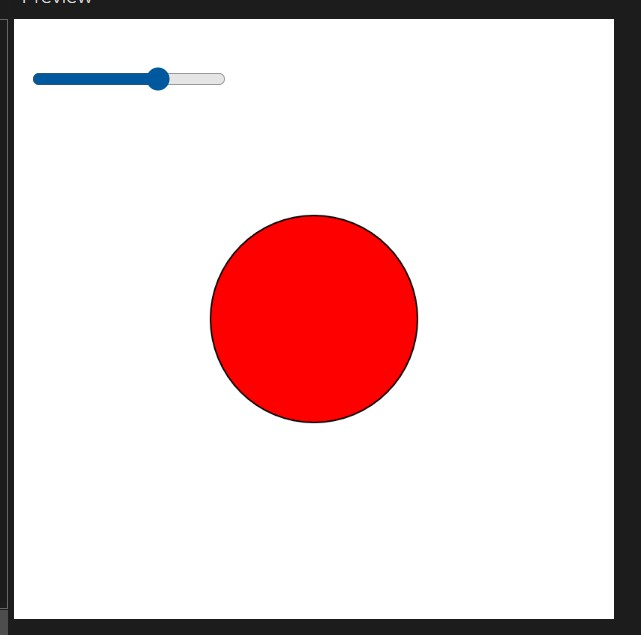
*I have created a slider which controls the size of a shape. The maximum and minimum size the slider could create is changed from the 'slider = createSlider' code section. Other features I was able to learn is repositioning the slider or the shape. Next, I would focus on multiplying the shapes and creating a slider that controls all at the same time where each shape and size is different.*

**A button that resets or randomises the drawing**

`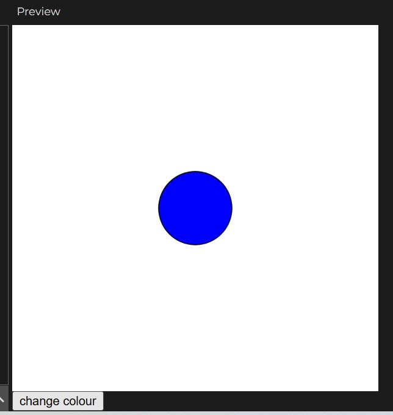'
*I have made a button that changes colour of the eclipse shape. The button works through a mousepressed() function that tells it to changecolour when mouse is pressed. The colours are changed randomly from three chosen colours using the change colour function. These features were very interesting to learn as it helped me understand how ceach function worked and how you can make different functions do multiple things.*

**A text input that displays a label on the canvas**

`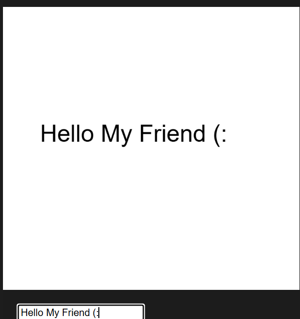
*The text input was created using createInput('') and was able to continuously update the sizing of the text and its position on the page. I was also able to position the text box randomly around the page too. One thing I struggled with is keeping the text on the page whenever the textbox or code is updated.The next thing I would try to do is use multiple text inputs, one that could remain fixed and one that is constantly updated.*

**Creating an interactive sketch that uses two DOM elements**
`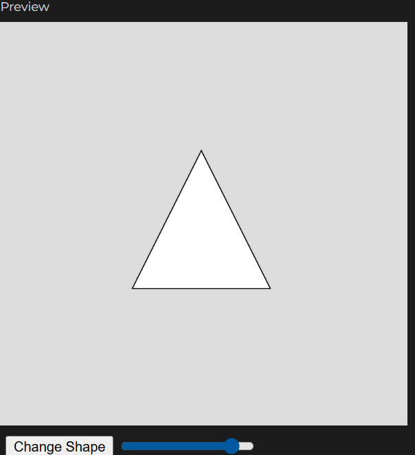
*For this activity I used two of the DOM elements to craete this sketch. I used a button that generates a random shape and a slider that increases or decreases the size of that shape. I faced some challenges while trying to make this one as I was unable to understand how the sequence of each code worked. After few trials and help I was able to combine both elements to work together.*

**Trying the CheckBox DOM element**

`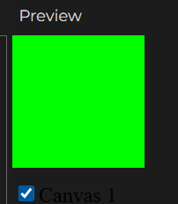'
*I used the createCheckbox() function in p5.js to control elements on the canvas interactively.The action happens only when the user checks or unchecks the box. The position of the checkbox is fixed relative to where the canvas page is as shown in the screenshot above. Elemnts such as colour, position and what appears when the box is checked can be modified to create a functionable interactive code. It would be even more interesting to use the checkbox function to create multiple checkboxes for a little game or even a simple to do list.*

**Activity 3: Vibe Code an Interactive Sketch**

`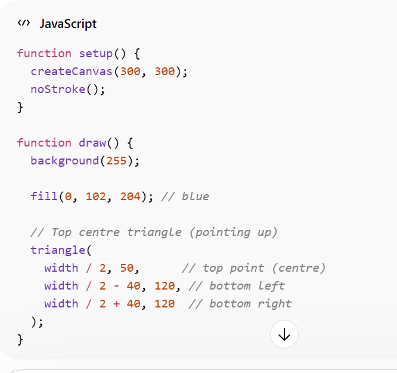'
*I wanted a sketch where multiple shapes (a circle, square, and triangle) were stacked on a canvas, and each shape could be turned on or off using checkboxes. I also wanted each shape to have a different colour and size. I used chatgpt to create the shapes and the colours I needed first, then added the checkboxes to the code. lastly was changing the positions and sizes of the sketch to how i wanted it to be.*

`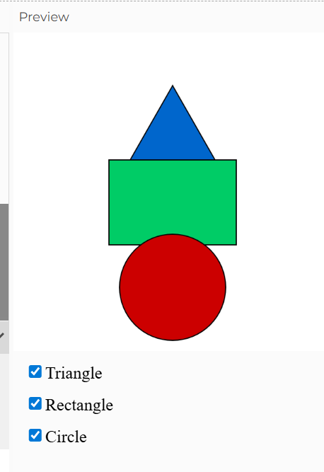
*Adding the checkboxes was simpler than I thought, I also found that the position of the checkbox isnt actually fixed and can  be changed but still has to be positioned in a clear way that is easy to use.
I understood that the checkboxes are part of the function setup and not the canvas which helped me understand the order of the code better. I wanted the shapes to be positioned in a certain space but also wanted to try doing it without the help of any LLM. The most difficult part was the triangle shape as it needed to be in the centre and pointing up. I did eventually use a litttle help from chatgpt to fix the shape as I was inable to keep all angles the same.*

## Independent Study: Interactive Data Portrait

*My first week’s experiment involved collecting data over a few days about my physical interactions with people. To transform this data into an interactive sketch, I selected elements that I thought would be best represented visually. I chose to include weather symbols to represent the time of day, colour codes for mood or feelings, and interaction symbols. I then selected four different data sets from the recorded data to use in this experiment. The data sets I have chosen vary in in the elements that have been used while still maintaining a realationship or a pattern of how my feelings and interactions relate to each other. Through this interactive sketch, iwas able to interpret them more clearly.*

*In this experiment, I learned and tried many different techniques that I was previously unable to use. I first started by drawing the shapes of the weather icons. The plan was to add image files and use them instead, but file images are not easy to add, and I thought it would be a good challenge to draw them using what I have learned so far.*

`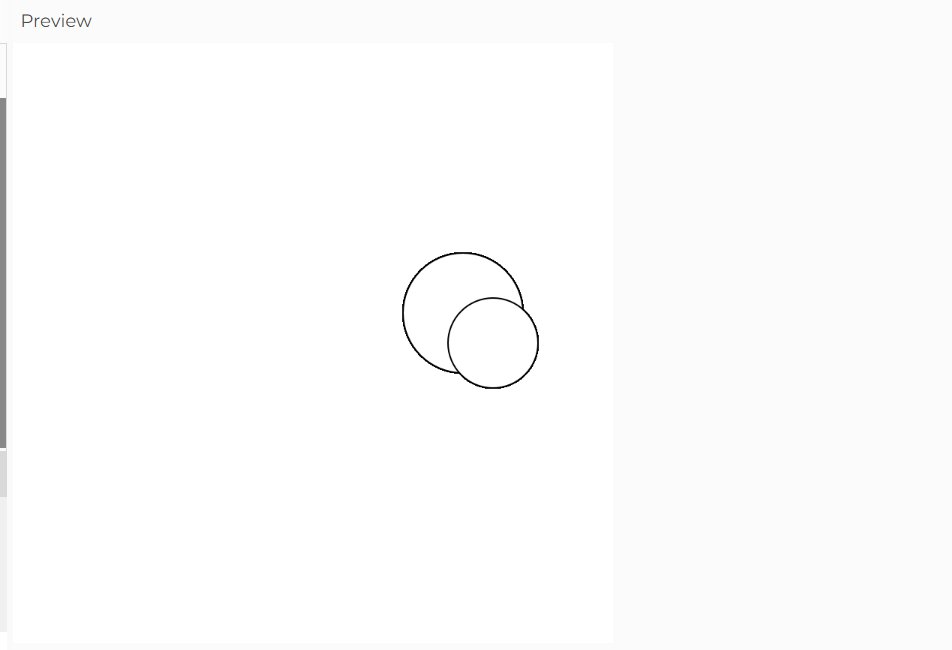

`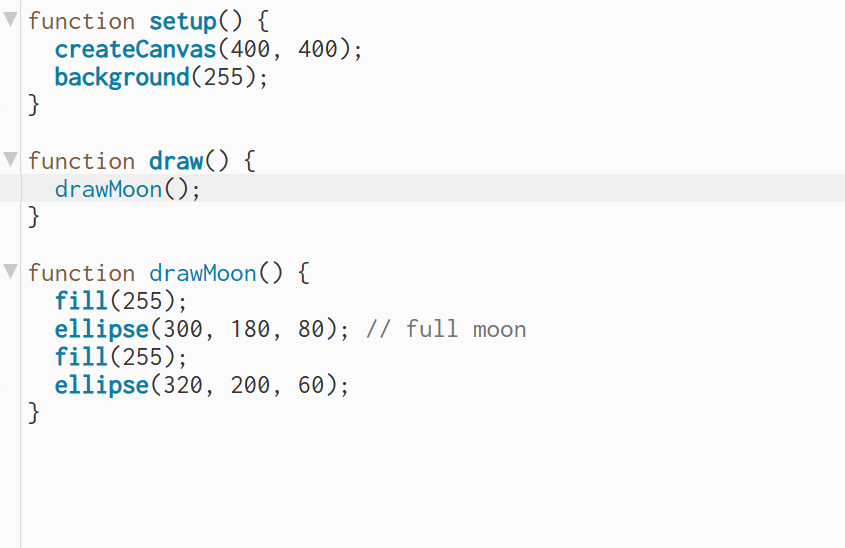
*The biggest challenge in drawing the weather symbols was aligning them correctly, so I had to keep them as simple as possible. Each piece of data was shown on its own screen, and I wanted to create a random shuffling experience with my data. I learned how to use the shuffle function through the p5.js reference, which allowed me to then add the rest of the elements.*

*I was unable to recreate the same shapes as in the portrait data, so instead I added horizontal single lines that move based on what the data represents. “Hug” is shown as two lines moving towards each other, “bump” is two lines moving towards each other and then away, and “nothing” as a single line moving across the screen.*

*Through this process, I was also able to experiment with line functions, movement, and built-in variables.
I used Vibe coding to help me understand how functions are structured and how they work together in JavaScript. It supported my learning by showing examples, which I then applied in my own code. Through this process, I was able to practise and improve my ability to structure and format functions correctly.
If i had more time to experiment with this interactive experiment, i would want to make my elements more realistic and make it clear what the interactions are. I would also incorporate other interactive elements such as slides and mouse movement features. This way it will more accurate and fun representation of my data.* 

*This screen shows the two lins bumping into each other and moving away.This is the friendly "bump interaction" which happened in the afternoon represented through a cloud symbol.*
`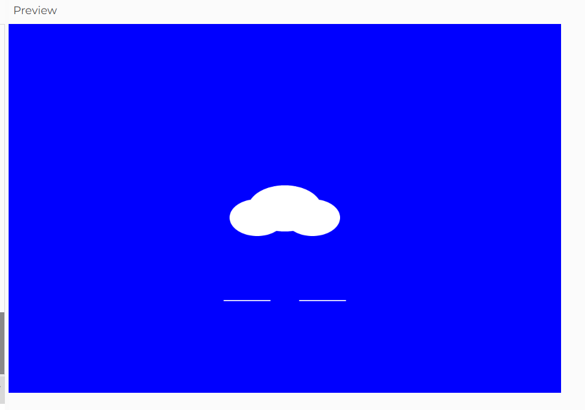

*The lines are intersecting in this one and have stopped, showing a happy "hug" interaction at nighttime represented through a lunar symbol.*
`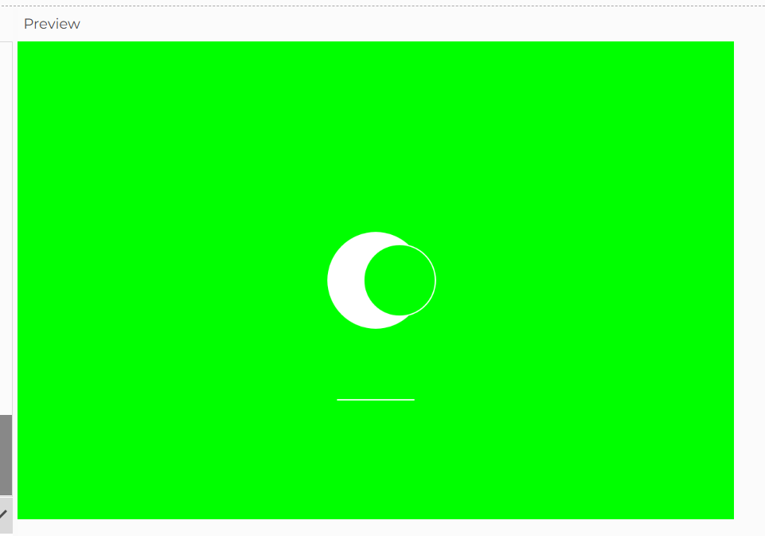

*This is a single line moving over the screen in the afternoon, representing that  "nothing" happened and i way feeling neutral.*
`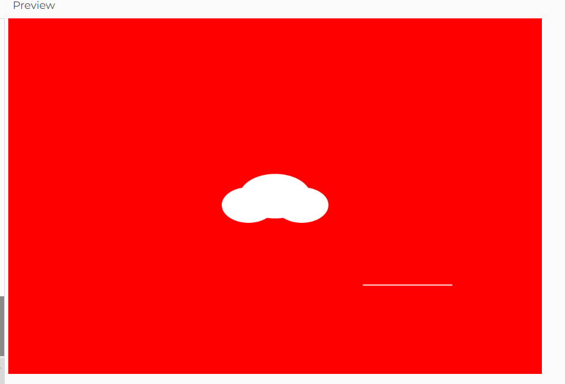

*This is also a neutral interaction with "nothing" happened in the morning represented by the sun symbol.*
`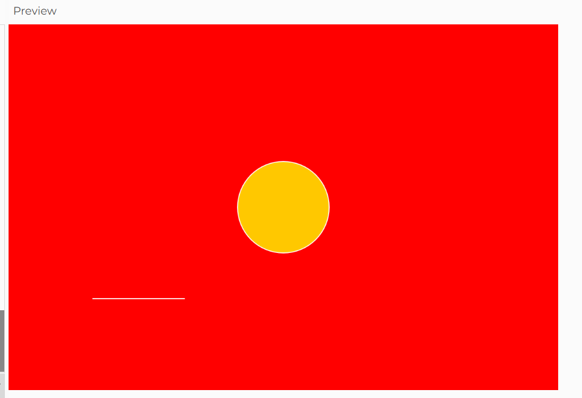

**Testing Observations and comments**
*Usage and instructions are clear and straightforward.*
*Symbols are clear in showing their intended purpose.*
*The colours do not represent the feelings assigned to each. For example red is usually associated with anger while I've used it for 'neutral'. This created a bit of confusion for the user.*
*Interactions are clear in conveying the action but not exactly the story behind it. The lines can a little vague which makes it harder to tell what exactly they are representing.*

## AI Usage Statement
*OpenAI. (2026). ChatGPT (April 2 version) [Large language model].https://chatgpt.com/*