[← Back to Home](../index.md)

# Week 03

## Documentation 

## Overview
*Through digital and analogue approaches, we are exploring how to access, filter, and translate live data into visual and material forms.*

*We have used the device terminal to learn how to interact the computers file system, learning how to use curl to retrieve live data and even learning to use ASCII Animations. 

`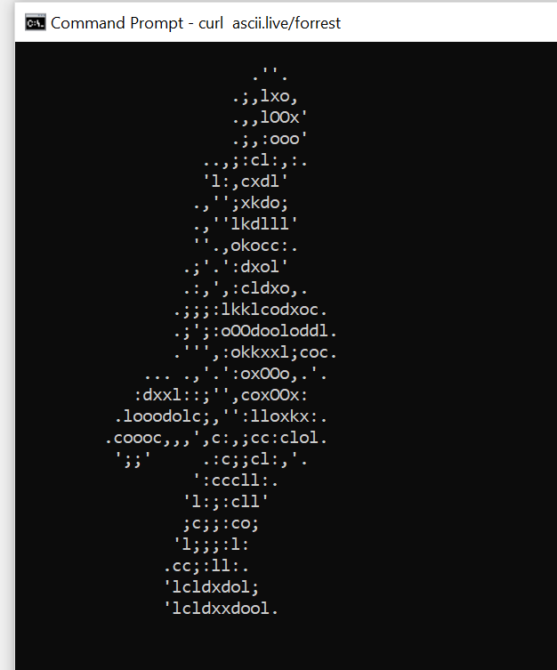

`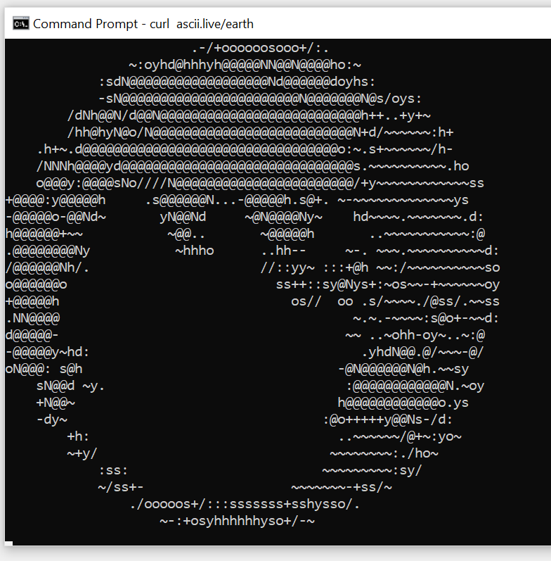
*These are a walking person and a rotating earth animations which we experimented with created through the terminal.*
## Activity 1: Explore with cURL

*Weather for Turkey using its GPS coordinates*
`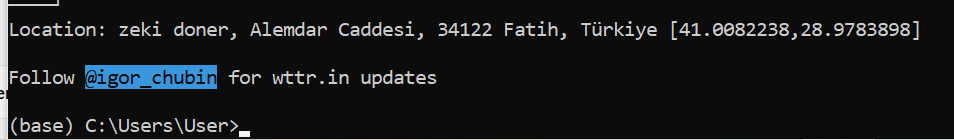

*The weather in Spanish language*
`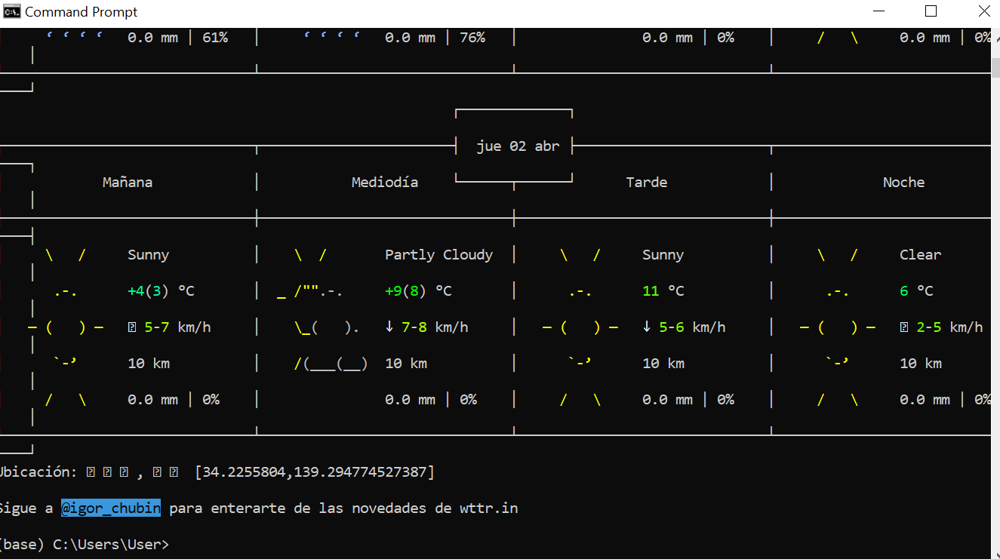

*Current moon phase*
`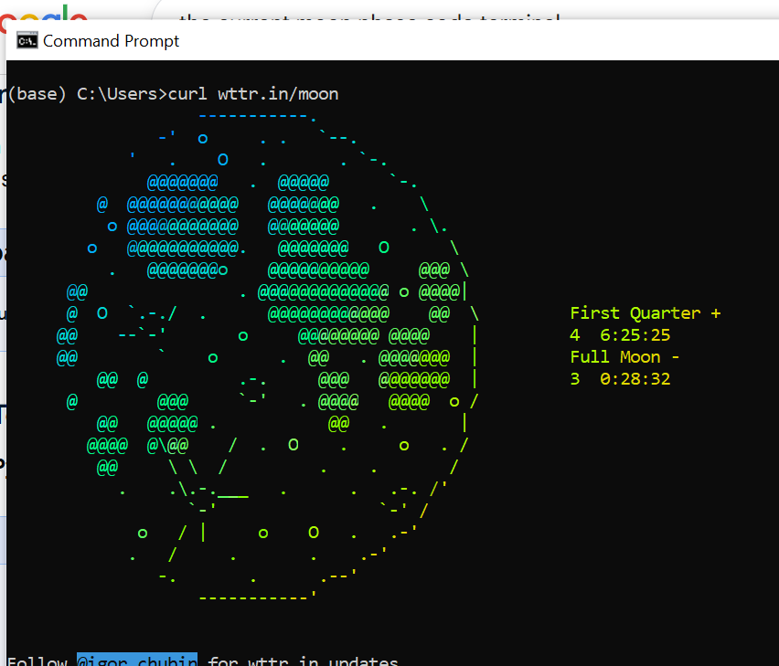

*Synonyms and antonyms of the word 'Place'*
`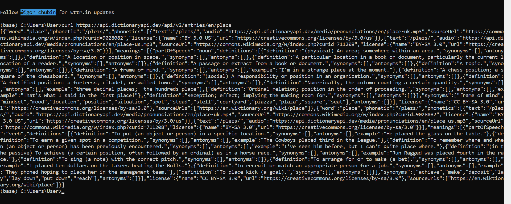

*Finding the weather of tourist areas in three different countries*
`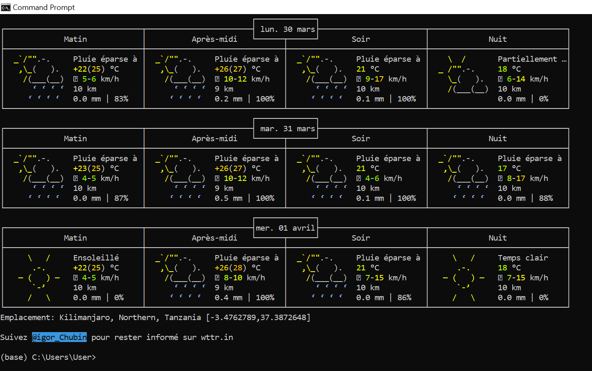
`

This activity gave me a better understanding of how Api works and how curl can be used to access real live data directly from the command line. I learned to access different types of data in similar ways however a small mistake in format can lead to unexpected errors. 

## Activity 2: Weather Visualisation

*Changing the latitude and longitude to a different city*
`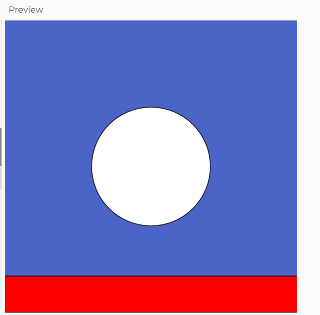
*When I used the GPS coordinates for Shanghai, the rectangle representing wind speed extended all the way across the canvas. This indicates that the wind speed at that location was very high compared to the scaleused in the initial sketch.* 

Using the data to control different visual properties: colour, position, size, number of shapes.
`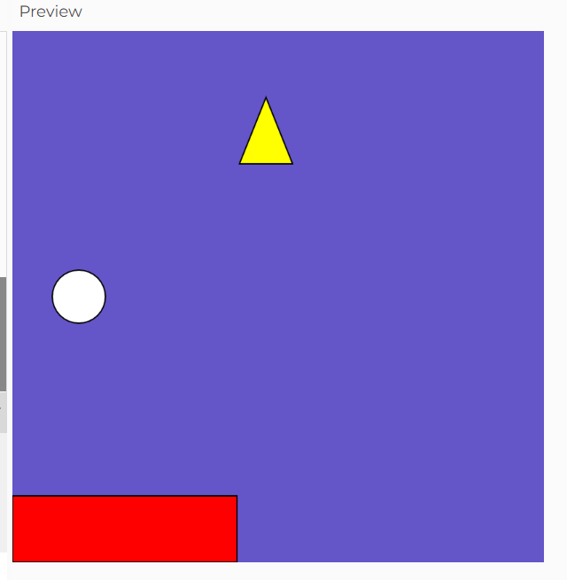
*When I changed the values of the circle to lower, it moved to the left and its size became smaller. The circle represents the temprature, hence the changes would indicate a drop in the temprature meaning the area became much cooler.*

*The triangle was added to represent wind direction so the point the shape is directing at is the wind direction.*

*The colour background represents the weather's humidity. The larger the values of the background the lighter the colour becomes meaning lower humidity in the air and therefore a better weather condition.*

*Adding more weather variables from the Open-Meteo documentationLinks*
`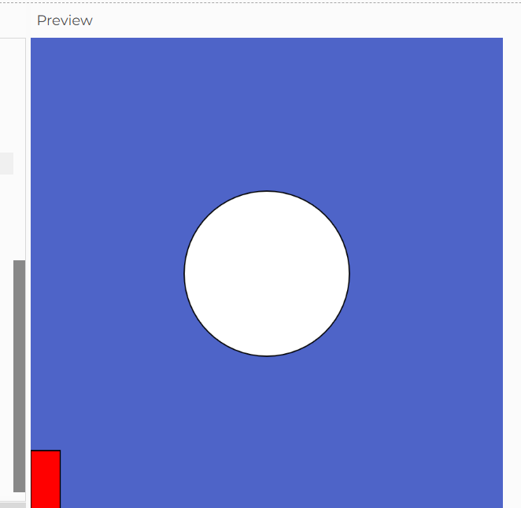
*The 'is_day' variable responded well to the viuslisation of the data and was able to interpret the timezone correctly. When this variable was added, the rectangle was longer and its value was shown as 1, meaning it is day.*

Try using random() or noise() alongside or instead of the live data.
`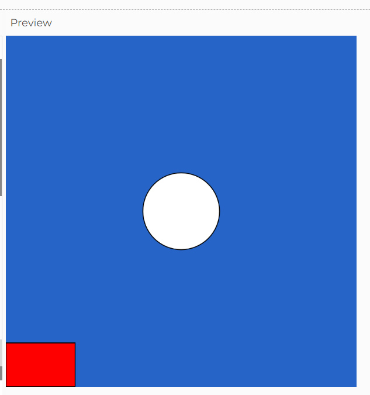

`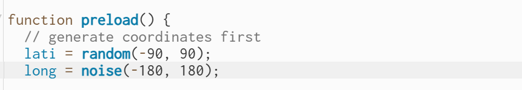
*When the random and noise functions were added, the variables positions, size, colour, longtitude and latitude were all unpredictable. Next time i would try to test each function on its own and see what happens to the data.*

## Activity 3: Design and Execute a Data Protocol

**Overview**
*In this experiment, we were asked to design a data protocol. The protocol needed to include a source (what live data to observe, such as sounds in a room), frequency (how often to record observations), and mapping (how each observation is represented visually).8

*My team designed a protocol that outlined what needed to be observed, for how long, and how it should be mapped. Another group then followed our protocol and recorded their observations based on our instructions.*
`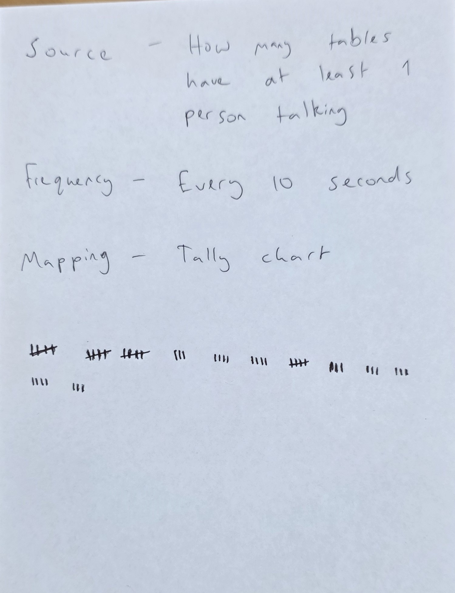

*We also followed another team’s protocol, where different line patterns were assigned to different sounds. However, since the space was enclosed, we were unable to conduct the experiment outdoors as we were asked and instead completed it indoors. This limitation affected the variety of sounds we could observe.*

`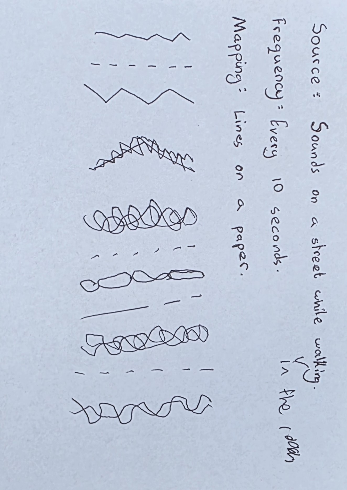
*Overall, the designed protocol was interesting because it allowed us to identify patterns in everyday sensory experiences, such as sounds we usually ignore. This process helped me understand how the environment can influence the outcome of an experiment.*

## Independent Study: Live Data Visualisation

*For this task, I built a p5.js sketch using the Foodish API to generate random food images. I wanted to explore how live data can be visualised in a fun but simple way, while also creating an engaging experience using something I like.*
`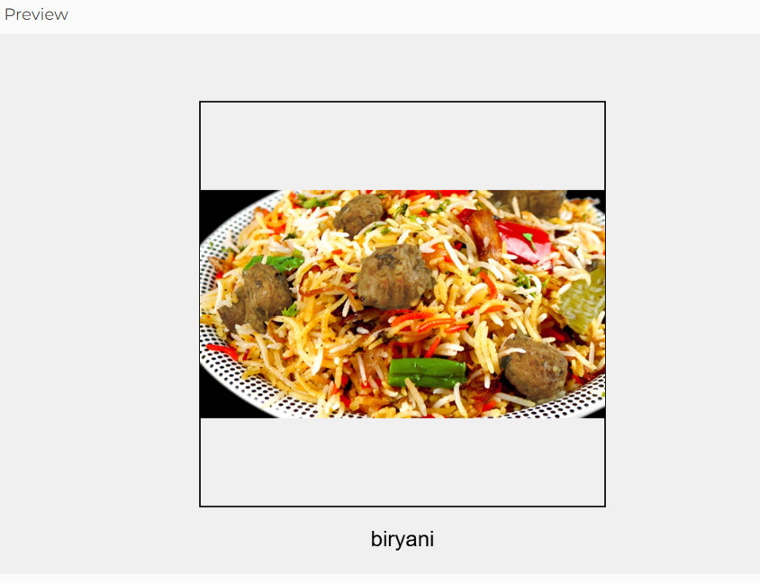

*For this activity, I used loadJson() function to access the Api images.Since my previous experiment in Week 02, I had used similar functions to display data and create random shuffling. However, working with live API data was more difficult. Once I understood how to fetch and use the data, I implemented the rest of the sketch elements, including image loading, positions, scale, colour, and timing.*

*I also added a loading time between every generated image to make the transitions smoother.*
`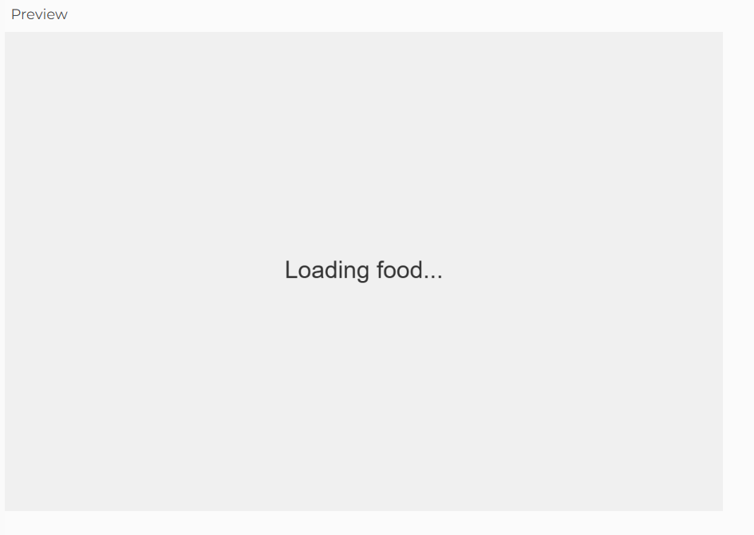
*A different food image appears.*
`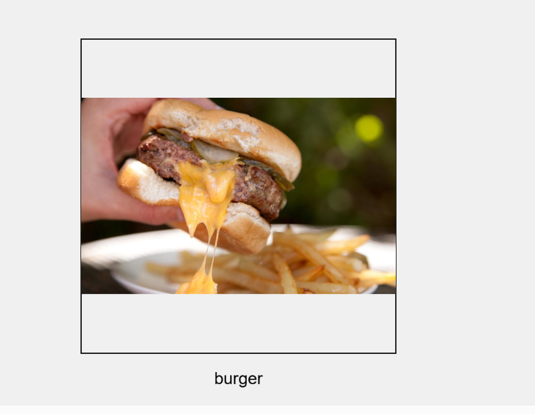

*Did you take a digital or analogue/physical approach? Why?
*I took a digital approach using p5.js because it allows real time interaction with APIs. I also chose this approach because I wanted to build on what I have already learned in this class and be able to create more advanced sketches using code.*

*What live data source did you work with, and how did you access it?*
*I used foodish Api which sends random food images and used the loadjson() function to be able to access the images URL.*

*How did you decide on the mapping between data and visual/material form?*
*I mapped each Api image to new sscreen and tried to create visually engaging transitions while also controllling the size, colour and position to keep the visuals consistent and balanced.*

*What does your work reveal or communicate about the data?*
*The data reveals random and unpredicatable set of data, it shows that data is not only communicated through numbers and can extremely vary in the way it is visualised. Working with data can also be fun and insightful.* 
*Did you use vibe coding, LLMs, or other tools in your process? What did you learn?*
*I used an LLM to help structure the API integration, and I learned how to correctly fetch and display live data in p5.js.*

*How does your work relate to the practitioner examples discussed in class (e.g. David Bowen, Conditional Design, Nathalie Miebach)?*
*My work is similar to these practitioner examples by using real time changing data to help create the final outcome.The randomeness and visual engagement with my Api is similar to the approaches these practitioners use to display their data though we use different methods.*

*What would you develop further with more time?*
*I would try to use more data and add more categories to the experience such as food type, recipies, or food colour. These would create more interactivity and have a greater visual influence on people.*

*Any other reflections?*
*After working on this experiment, I feel more confident in working with Api's and live data in general. I was also able to learn a lot of useful tools that would potentially help me in other or future design courses such as using code to create sketches, working with live data, and learning how to communicate data through interactive element and influence users or viewers in a different way.*

## AI Usage Statement
*OpenAI. (2026). ChatGPT (April 2 version) [Large language model].https://chatgpt.com/*