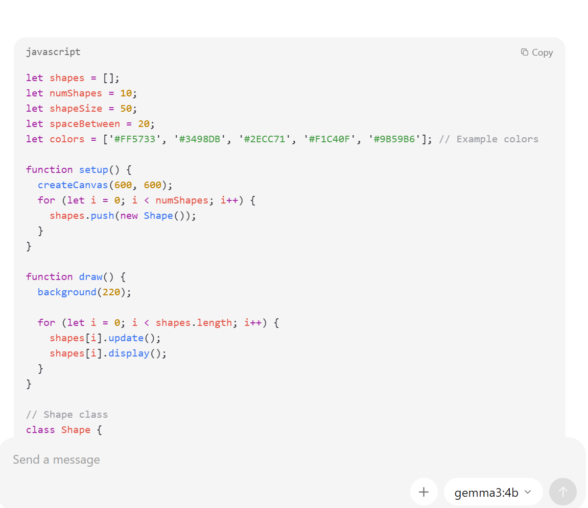
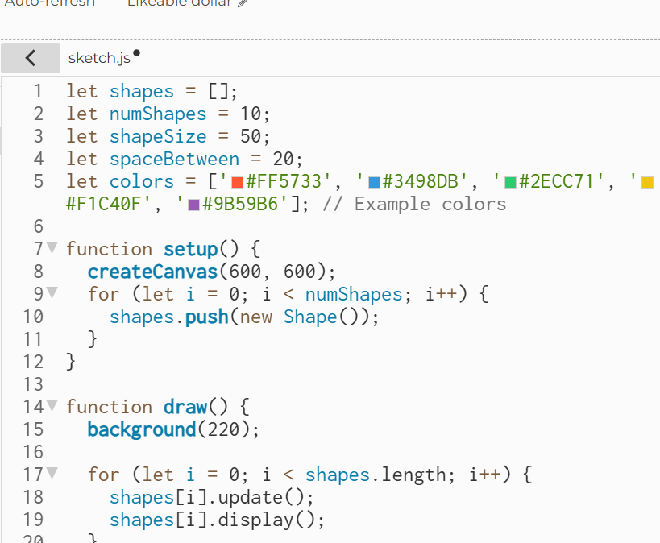
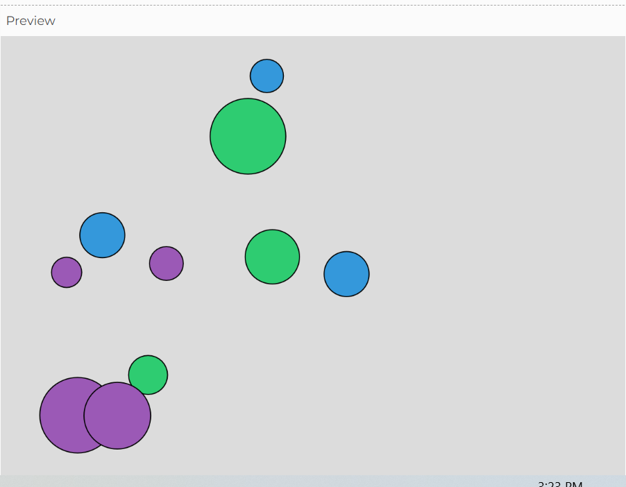
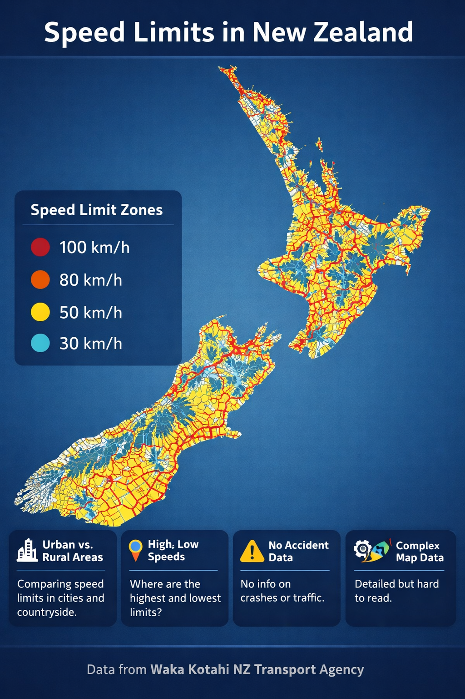
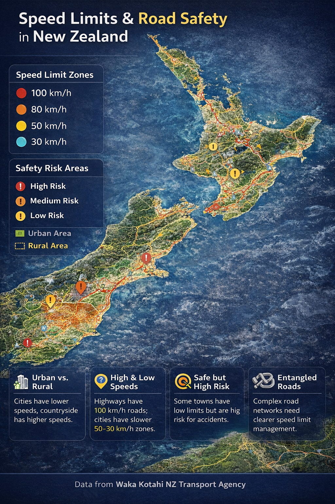
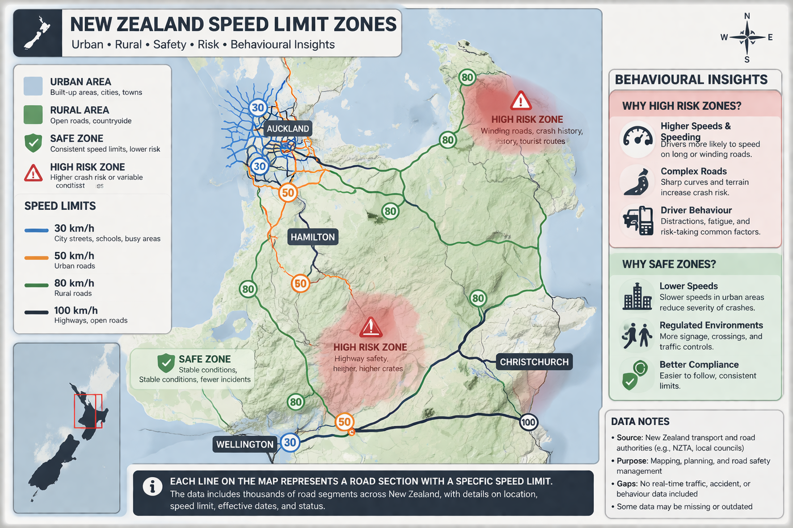
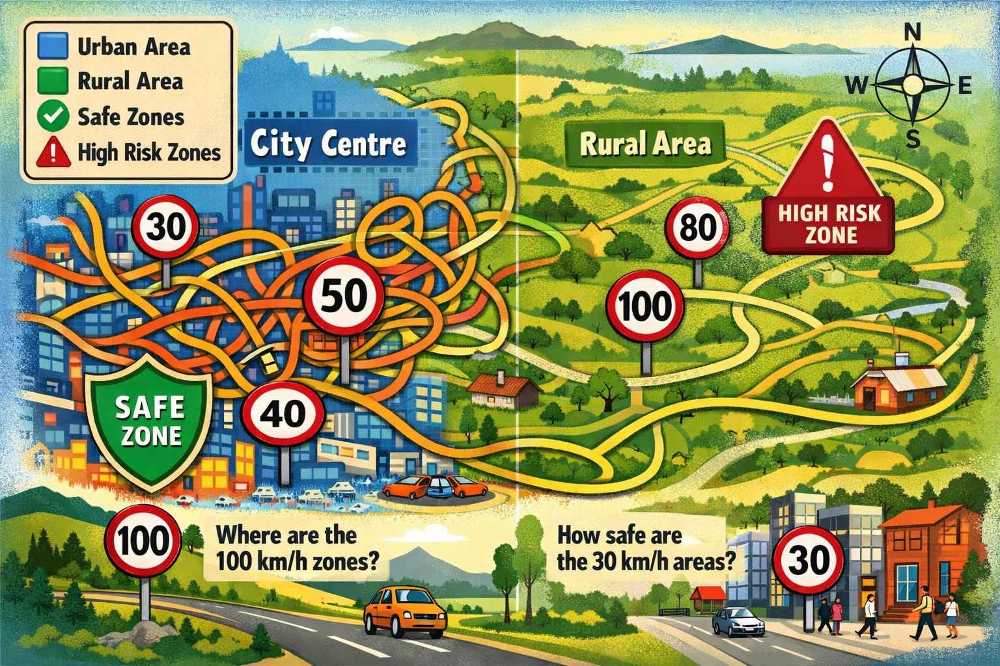

# Week 04

[← Back to Home](../index.md)

## Documentation 

## Activity 1: Local AI with Ollama

*In this experiment we are learning to use a local AI model and using in a similar way that would use a cloud AI model.*

*My first interaction with the app was very smooth and simple. I asked for basic information such as food recipes and general knowledge. Compared to ChatGPT and other cloud AI tools, the speed at which information is delivered is generally slower and has more limitations. However, I found it to be very capable, which was not what I expected. It follows instructions clearly and generates what you ask for.*

*I then challenged it to generate code for shapes in p5.js. I found that it needs more detailed instructions to match the exact vision I had. However, it responded well and produced a code without errors. The main issue was the time it took to generate the code compared to other models. The first response took about 5–10 minutes. As the task became more familiar, the response time improved. Next, I asked it to generate an image. It was unable to do this directly, but instead provided a detailed description of how the image would look. The description was simple, clear, and well structured.*

*Code written by Ollama*
`
*Ollama P5.js sketch and code*
`
`

## Activity 2: Cloud AI with NotebookLM (not yet done)

## Independent Study: AI-Assisted Data Exploration

**Step 1: Find a Dataset**
*In the first step of this activity, I looked for a dataset through catalogue.data.govt.nz that interested me. After exploring different datasets, I chose the “New Zealand Road Speed Limit” dataset.* 

**Step 2: Understand the Data**
*The data was then downloaded in a CSV file and uploaded to ChatGPT.*

*The data was downloaded as a CSV file and uploaded to ChatGPT.*

*Through the conversation I had with ChatGPT and the questions I asked, this was the result:*
*The dataset shows patterns in speed limits across New Zealand. It can tell stories about differences between cities and rural areas and how regions manage road safety. It includes information such as where speed limits are highest or lowest and how they change by location.*

*However, the dataset has gaps and biases. It only shows official speed limits and does not reflect how people actually drive. It does not include accidents, traffic, or reasons for the limits. Some data may also be missing or outdated, and parts of it can be hard to understand due to its complexity.*

**Step 3: Design Multiple Representations**
*I asked ChatGPT to produce a visualisation of the dataset, then guided it through iterations toward an outcome I was satisfied with.*

*This was the first visual image produced*

*The second iteration showed a more realistic-looking map and included information from the dataset on road safety.*

*The third image was visually more complex and created a feeling of uneasiness. It was hard to understand and not what I had in mind.*

*In the final iteration, I gave a more detailed explanation of how I wanted it to look and included more storytelling elements. This made the image easier to understand and more interesting to look at.*
`

**Step 4: Critically Evaluate**

*What did the AI default to? (e.g. bar charts, blue colour schemes, generic titles)*
*In the first iteration, the AI created a general overview of the whole New Zealand map rather than focusing on roads and rules. The colour scheme was blue, and the speed limits across the country were colour-coded on the map.*

*What did you have to override or redirect?*
*The main thing I needed to redirect was the inclusion of more important points from the dataset. Instead of focusing only on speed limits, I wanted to include other related factors. I also wanted the visualisation to be as clear as possible, which meant controlling how many elements were included in the image.*

What assumptions did the AI make about the data or the audience?
*The AI assumed that the audience would prefer a simple and general overview of the data, rather than a detailed or storytelling-focused visualisation. It also assumed that showing speed limits alone was enough to represent the dataset, without including deeper context such as road conditions or human behaviour.*

Which representation is the most interesting, and why?
*The last iteration is the most interesting. While there is still room for improvement, I believe it is the closest to my original vision. The image not only shows data through symbols, numbers, or words, but also includes place, people, and colour. Although the data may not be as accurate as in earlier images, it explains the relationships more clearly for the audience.* 

What would you do differently if you were building this without AI?
*If I were building this without AI, I would first focus on the relationships within the dataset and how they connect to real-life experiences. I would aim for a more vibrant and simple visualisation that tells a clear story about everyday life.*

prompts
OpenAI. (2026). AI-generated visualisation of New Zealand speed limit zones showing urban and rural areas, risk levels, and behavioural factors [AI-generated image].

AI-generated map of New Zealand speed limit zones. The image visualises road segments using neutral colours to distinguish urban and rural areas, with line thickness representing speed limits. High-risk and safe zones are indicated, along with behavioural factors such as speeding, sharp turns, and pedestrian activity to support storytelling beyond raw data (generated using ChatGPT, 2026).

## AI Usage Statement
*OpenAI. (2026). ChatGPT (April 2 version) [Large language model].https://chatgpt.com/*