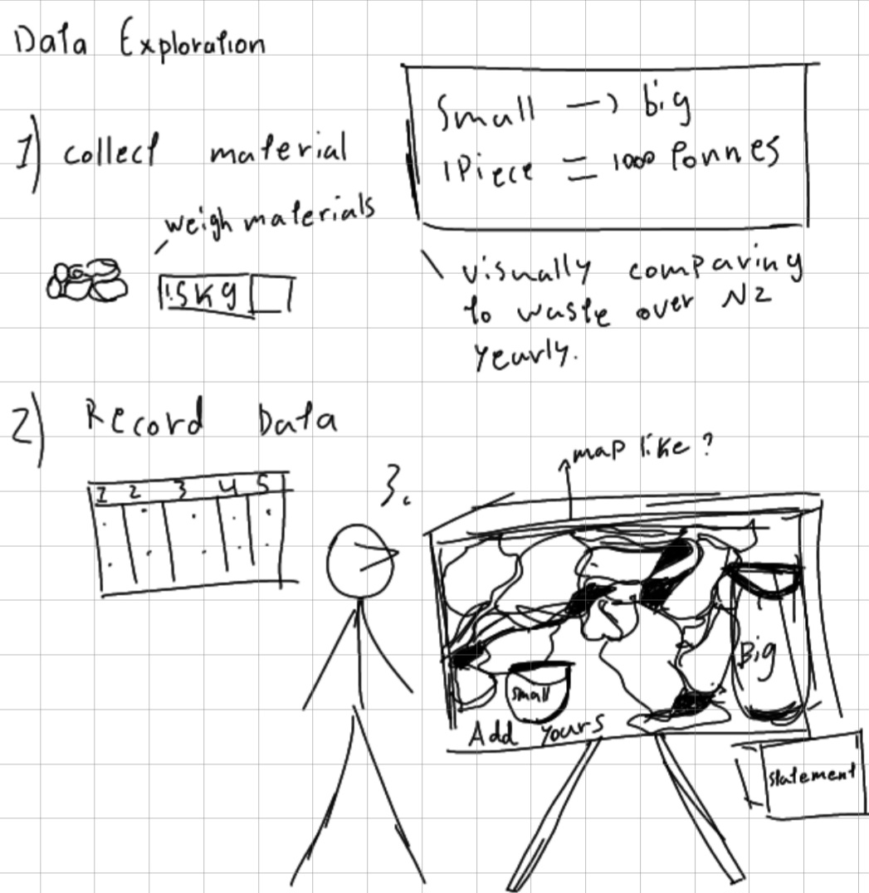
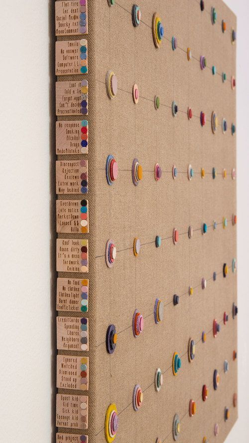
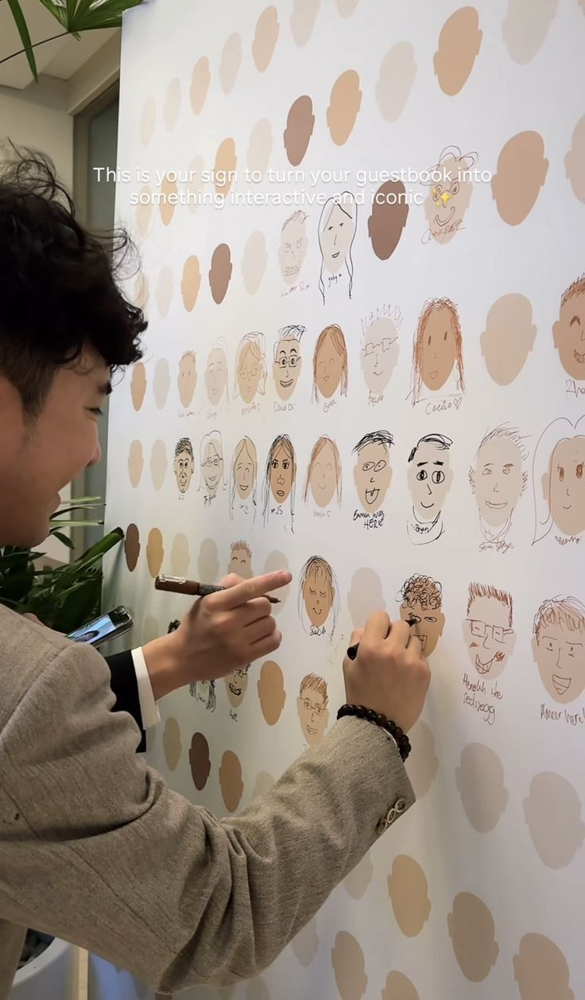
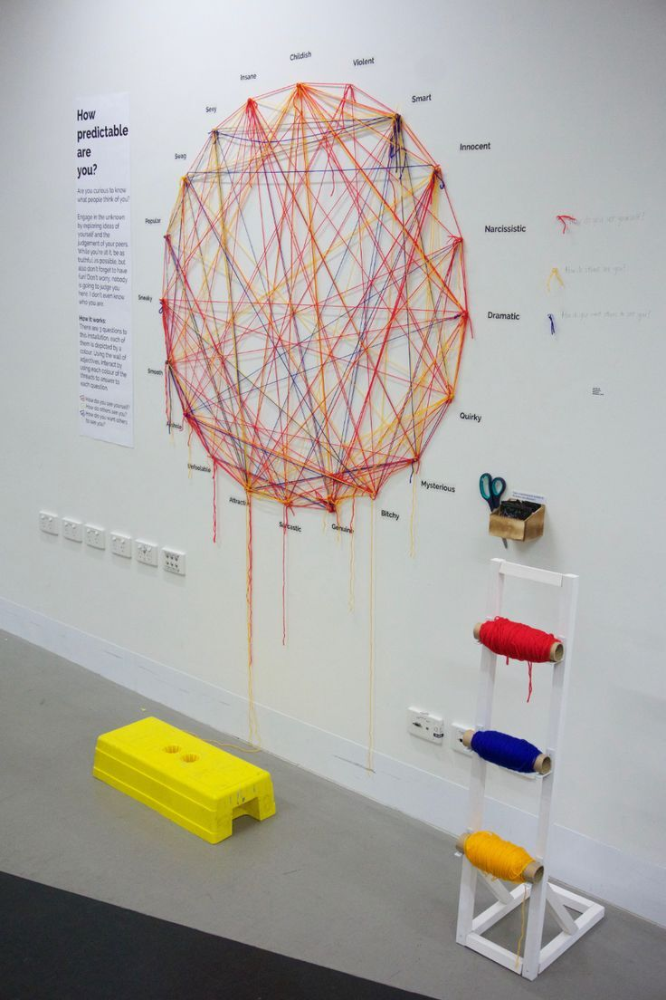
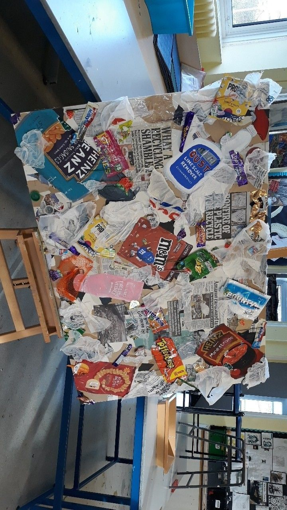
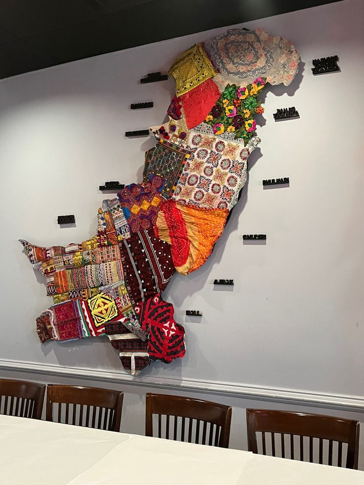
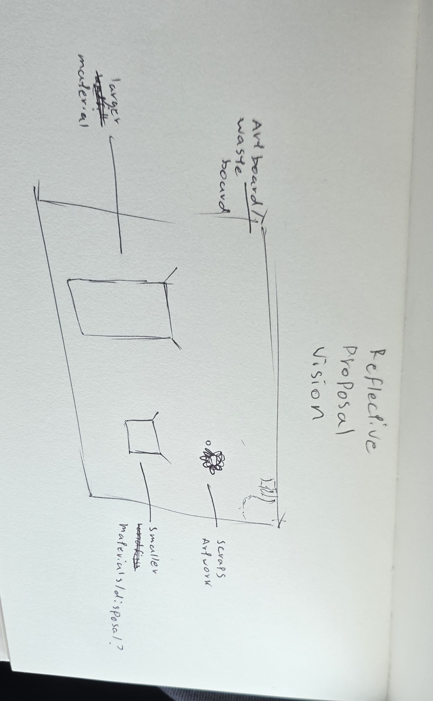

# Week 06

[← Back to Home](../index.md)

## Activity 1- Data Exploration

**Dataset overview**

*The dataset comes from the New Zealand Ministry for the Environment’s material waste guide and provides national-level estimates of waste generated by different material types across New Zealand.*

**What fields does it contain?**

*The dataset includes information about different material categories such as paper, plastics, organics, metals, and textiles. In some sections, it also separates waste into broader categories such as household, commercial, and construction waste.*

**What format is it in?**

*The data is presented in a report and web-based format rather than as a downloadable spreadsheet or database. Most of the information is shown through statistical summaries, percentages, and written explanations rather than raw numerical datasets.*

**What are its limitations or gaps?**

*The dataset has several limitations. It does not separate waste into specific fabric types, material sources, or recycling methods. This is important because different materials have different environmental impacts and recycling possibilities. The dataset also lacks information about how or why the waste was produced, making it difficult to identify the causes of waste generation or evaluate sustainable practices such as reuse and recycling.These gaps may limit the depth of analysis possible for the project and could require additional research or data sources to better understand material waste behaviours and sustainability practices in New Zealand.*

**Personal Dataset Collection Process**

*This is the personal data collection process. Where material is collected over the weeks, measured by weight and is used to create an art piece that visualises the colected material.*

`' 

## Activity 2 - Visual Research

**Data Board**

`'

**What draws you to it?**

*What draws me to this work is the way small layered objects are organised into a structured visual system, making personal experiences and behaviours feel collective and interconnected.*

**What could you carry forward?**

*Using repeated physical pieces, such as recycled PLA,wooden pieces  or fabric scraps, to represent individual waste contributions while arranging them in rows or pathways to reveal patterns over time.*

**Does it shift your direction?**

*It reinforces my direction of using different pattern methods, such as size, volume, color, etc.*

**Data Prtrait**

`'

**What draws you to it?**

*What draws me to this work is its participatory element, which makes the data feel more personal by allowing individuals to leave a trace of themselves within a shared visual system..*

**What could you carry forward?**

 *Incorporating student participation within the design, such as allowing users to actively add their own waste materials or mark their actions within the installation.*

**Does it shift your direction?**

 *It expands my ideas beyond simply visualising data by exploring how users can also contribute to it. While it ecourages the audience, i also realise this may be hard to implement in a busy enviroment such as the design space.*

**Data String Visualisation**

`'

**What draws you to it?**

*The complexity of the woven threads visually communicates relationships, movement, and patterns of human behaviour over time.*

**What could you carry forward?**

*Using thread or fabric connections to represent relationships between waste types, material flow, or the frequency of waste accumulation within the system.*

**Does it shift your direction?**

*It visualises a system of interconnected behaviours, rather than only presenting isolated pieces of data which slightly shifts the way I view data into something less complex and fun.*

**Plastic Scrap physicalisation**

`'

**What draws you to it?**

*The use of recycled plastic waste to create a physical artwork creates a strong visual impact and highlights the scale of waste accumulation over time.*

**What could you carry forward?**

*Allowing waste materials to gradually accumulate within the installation so the artwork directly reflects real waste behaviours and participation over time.*

**Does it shift your direction?**

*It reinforces my focus on making waste physically visible through accumulation, supporting my aim of encouraging greater environmental awareness and responsibility.*

**Tactile Data Wall Art**

`'

**What draws you to it?**

*The layered and tactile arrangement of materials transforms abstract behavioural data into a physical, map-like artwork that feels more relatable and engaging.*

**What could you carry forward?**

*Using small repeated physical units, such as fabric scraps or PLA waste pieces, to represent data quantities within a structured visual system.*

**Does it shift your direction?**

*This board aligns with my idea of representing accumulated materials through a piece of artwork, however not so randomely as shown above.*

## Activity 3 - Project Planning and Skills Roadmap

*3.1 What do I need to make?**
*A shared board in the design space sorts fabric scraps by size and includes scrap-made artwork, making waste visible and encouraging students to reuse materials instead of sending materials to landfill.*

**3.2 What do I need to learn?**

  *Learning how to shape, melt, or assemble discarded materials and specifically PLA into the shapes I want.*

  *Understanding how to translate numerical waste data into physical forms, patterns, and structures.*

  *Designing a system that allows users to contribute materials while keeping the installation organised and visually effective.*

  *Experimenting with textures, attachment methods, durability, and accumulation methods.*

  *Improving methods for recording and organising waste contributions from participants.*

**3.3 What are my next steps?**

*My next step will be to begin developing physical prototypes and testing how waste materials can visually represent data in an interactive piece. I plan to experiment with recycled PLA waste, fabric scraps, and other discarded materials to explore how they can be attached, layered, or accumulated over time. I also need to test different layout systems and elements to determine which best communicates relationships between waste data and the intended impact. Getting better understanding of the waste data itself by identifying clearer categories and finding additional sources that provide more detailed information about recycling and material usage in New Zealand. Through prototyping and testing, I aim to refine how participation and data visualisation can work together to create a more engaging and impactful piece.*

## Independant Study

**Consultation Reflection**

*During the consultation, I was given the opportunity to introdice my project, including the theme behind the project, the data collection process, its intended impact, and finally, ideas for my final artefact. My strongest areas were the thematic focus and the impact I wanted to make through this project. The consultation helped me better structure my project and understand where it currently stands. I was able to connect my ideas more clearly and better link my project to the data that I chose. One of the main pieces of feedback received was that the personal data collection process was still unclear, especially how the collected data would be represented and communicated to the audience in a clearer manner. I received feedback on the importance of having textual elements within the artefact to help deliver the data more clearly. The session also helped me realise the difficulty of collecting and analysing data at the same time and delivering both points effectively in a single artefact. This discussion encouraged me to narrow my focus and use a more targeted dataset that is still relevant to my topic. This allowed me to plan better for my next steps and realise what is possible for this project.*

**Technical Skill Building**

*My first priority technical gap in my skills roadmap is to improve my understanding of how to translate numerical data into effective physical forms that communicate ideas clearly to the audience. To address this technical gap, I researched different visualisation techniques, analysed similar project examples and looked for experimentation methods for material reuse. I wanted my main focus to be on learning how to handle material and learning the limitations within the data that’s been collected.*

**Initial Concept Sketch**

`'

## AI Usage Statement

*This work was completed without the help of AI*
