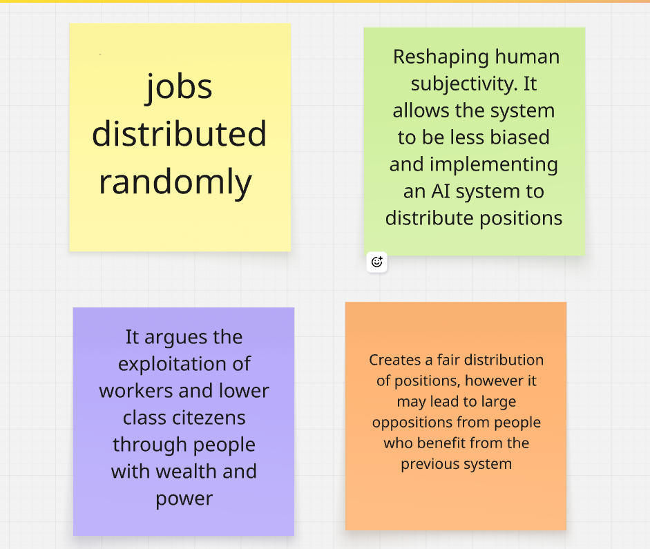

# Week 09

[← Back to Home](../index.md)

## Documentation 

*Include your documentation for the week. Devise your own structure of headings relevant to the required tasks and your process.*

## Images & Media

*Use the format below to embed images from your assets folder:*

**Project Statement: First Draft**

*Case Study*
*In the first activity we did a review of the Xeno Computer 0.1: Labor case study by Tega Brain and Sam Lavigne. We are asked to answer the following questions What are the data sources used in this work?, What is the future scenario it addresses?, What does the statement argue about data and power?, What might be the intended impact, and is this included in the statement?*

*I have written my answers on a sticky note on the shared miroboard folder.*
`'

*Drafting with NOtebookLM*

your Reflective Proposal
journal entries for weeks 7 & 8
practitioner references from weeks 7 & 8
data source documentation or links
any other relevant sources
Using the template prompt from the class slides, generate a draft project statement.

Evaluation
Read through your draft and make notes in response to the following:

What is working well?
What is missing or underdeveloped?
What feels overly generalised or AI-like?
What do you need to research further?
Write one sentence that commits to the direction of your project.
Peer Share
Share your draft and evaluation notes with a peer. Take turns (5 minutes each) and ask your partner to respond:

What is clear and compelling?
What still needs to be developed or resolved?

## Activity 2 - Making Sprint

Before beginning, take 10 minutes to plan your sprint. Draw on your draft project statement and the feedback you received. Identify what your project most needs right now: what will you develop and test? Set specific goals and consider what tools and materials you will need.

Use the next 35 minutes to make focused progress on your project. Work towards your specific goals. The aim is to produce a testable thing, not a finished outcome. Address the challenges most relevant to your current direction, and collect documentation for your journal as you go.

Before beginning, take 10 minutes to plan your sprint. Draw on your draft project statement and the feedback you received. 

*What the project needs most?*
*What the project needs most right now is a clear direction for visualisation that is stilol relevant to my material component. This would help make the next stages of making easier once the final work is planned out.*

*What I will be developing and testing?*
*I will be developing the most (interactive a space that reflects a future natural enviroment)
*Goals*

*Tools and materials*

*In this activity, since I am unable to use the materials I had collected so far, I decided to create an AI generated image of what I wanted the project to look like. While the AI generated image cannot fully and accurately capture the vision I have but it provided a solid layout and included all the important components of the project.*

*I gave chatgpt a prompt, the first result was not really what I had in mind so I spent time developing and refining the results. I went through four iterations, with each iteration, I focused on a different aspect of my design that requires more improvement or clarity.* 

*I can see a clear vison for the interactive aspect of this the models created. This has helped direct back to my initial plans for interactivity that would still be functional through the current vision for my artefact.*

image1
image2
image3
image4

##  Activity 3 - Round Robin Rapid Reactions

*In this activity we are asked to split into two groups, where one froup is presenting and the other is visiting. This session helped us recieve feedback and suggestions for our project. It also allowed us to visit other student's work and gain a fresh perspective of the different approaches of others.*

*Questions and Comments*

Does the project statement clearly outline a provocation?

What does the sprint outcome suggest about where the project is heading?

What does this work make you think or feel about its subject matter?
What needs to be resolved before the week 12 showcase?
Presenters: note down reactions and questions/ideas, and add these to your journal entry.

## AI Usage Statement

*Document any use of AI tools under an AI Usage Statement heading. Explain which tools you used and describe how you used them. Reference any AI-generated content (see [QuickCite](https://auckland.libguides.com/referencing-generative-ai-tools) for guidance).*
