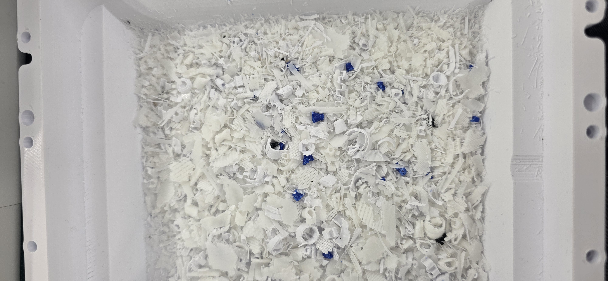
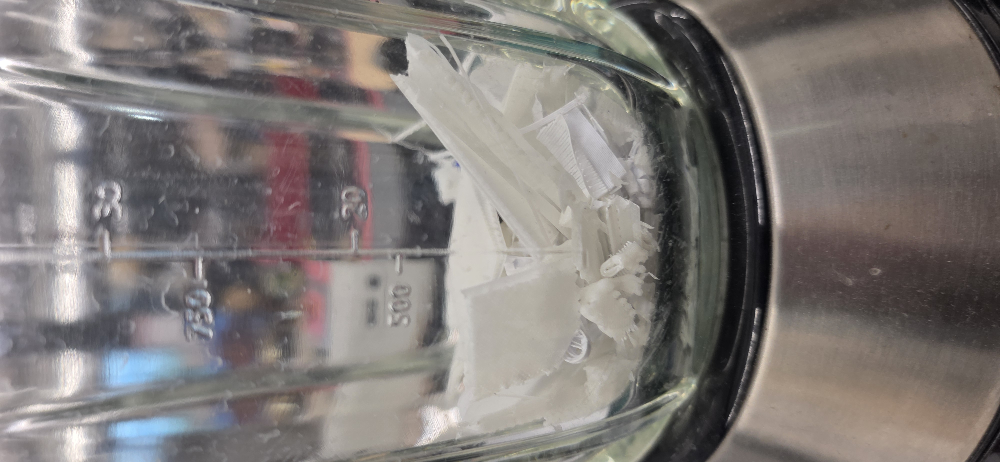
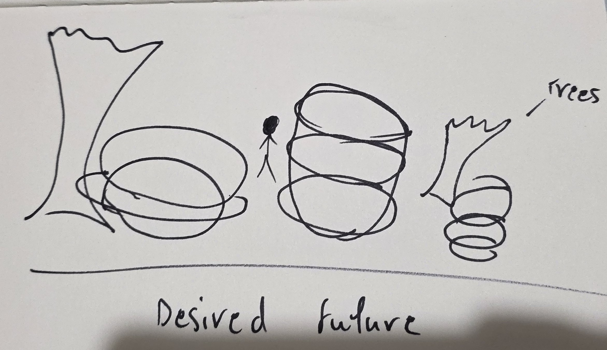

# Week 10

[← Back to Home](../index.md)

## Project Development

`

`

*In this weeks project documentation, I was able to mix up some of the data collected. However due to the limitation of the lab's materials, I was unable to reuse all the materials collected. I will need to make sure that the data is still shown through the reshapement of my project.*

`

## AI Usage Statement

*This work was completed without the use of any AI tools.*