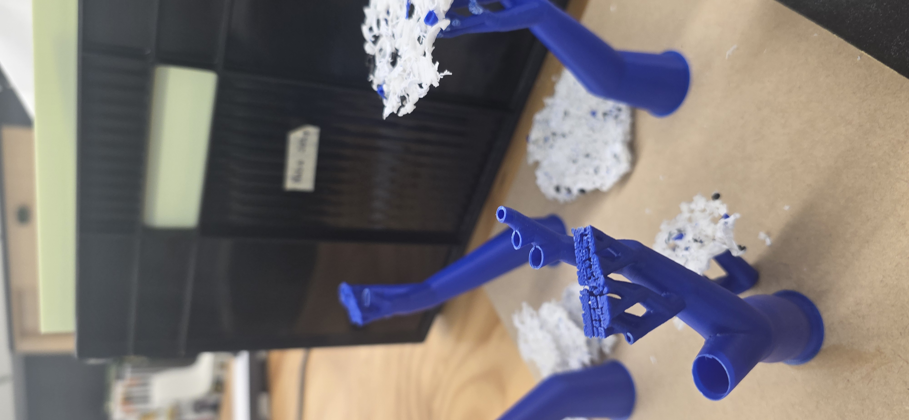
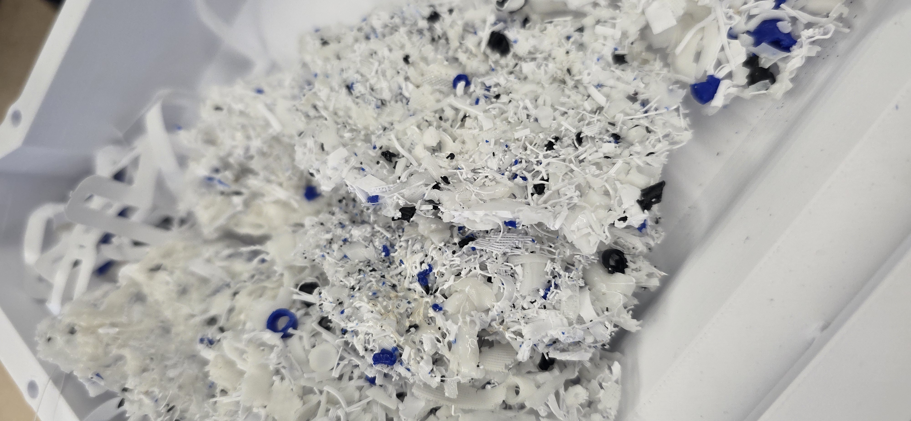

# Week 11

[← Back to Home](../index.md)

## Activity 1 - Journal Review

**Overview**

*In this activity we are reviewing our partner's journal entries and checking off their list of of journal entries.*

**Discoveries**

*The amount of PLA waste collected each week was lower than I expected, but still revealed inconsistent disposal practices in the design lab. This led me to focus more on making even small amounts of waste visible and meaningful through the final model.*

**Challenge**

*I realised that turning raw PLA scraps into usable sculptural material is more complex than expected and will require testing different methods.*

**Decisions**

*I decided to directly show my data through the material itself by using weight to determine shape and scale, and volume to represent the total amount of waste collected. This makes the relationship between data and physical form more clear.*

## Activity 2 - Practice Consultations

**Parctice Consultation 1**

*In the first practice consultation, I felt my responses were clear and showed a good understanding of my project, but there were gaps in how I explained the visualisation. I need to be more specific about how the final outcome will look and how it represents the data. I also received feedback about scaling the artefact larger, but I am still unsure how this will work effectively with the small amount of material collected.*

*In the second practice consultation, my ideas became clearer and more focused. However, I still need to improve the depth of my explanations, especially when describing the process and reasoning behind my design decisions.*

## Independant Study

`

`

*The support trees represent PLA waste in its original form, showing the material that is regularly produced and discarded through 3D printing in the design studio. The circular forms represent the same material after it has been collected, crushed, and melted down, symbolising its transformation into a reusable resource.Each structure represents one week of collected data. The diameter of the structure shows the total weight of PLA collected that week, while the volume represents the number of individual pieces collected.*

*The blue support trees are actual 3D printing support structures. Initially, the artefact was intended to include real trees to represent the environmental setting. However, I realised that the larger materials collected from my dataset resembled trees and naturally acted as a support system themselves. This was successfully incorporated into the design, helping to represent a future built on stronger support through the reuse of discarded materials.*

## AI Usage Statement

*This work was completed without the help of any AI tools.*