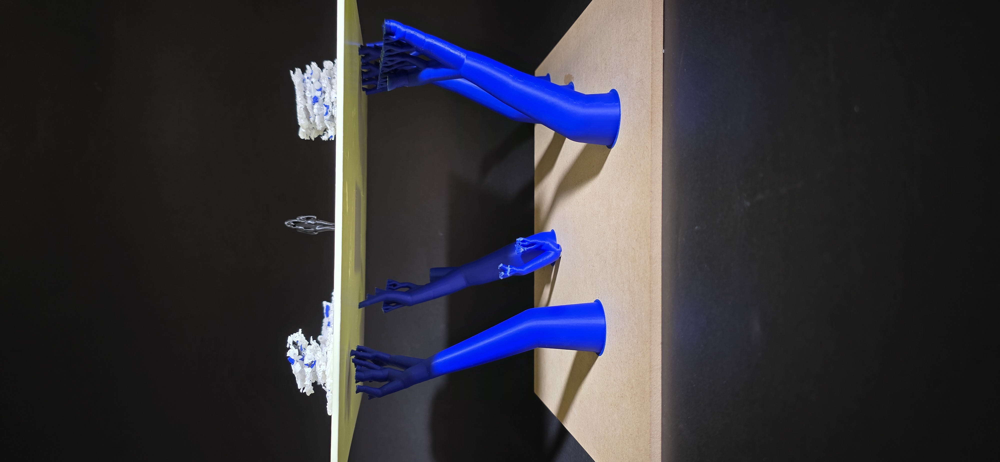
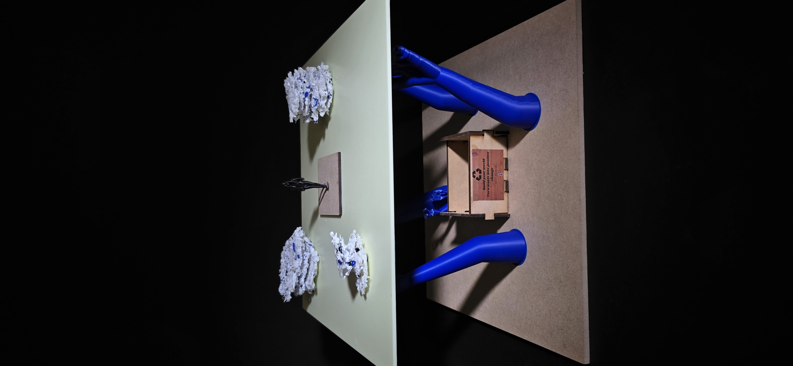
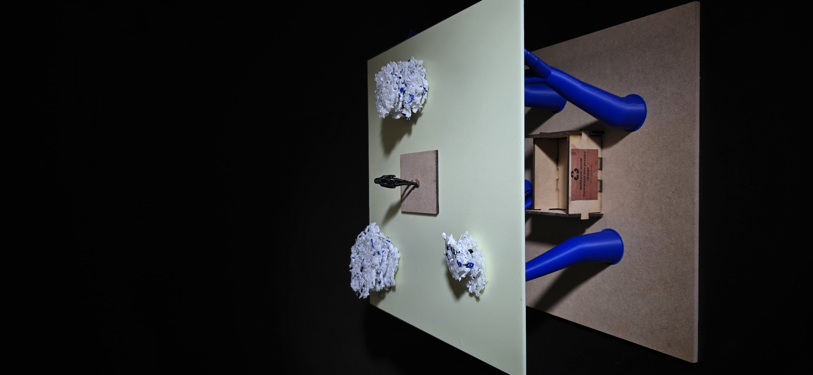

# Week 12

[← Back to Home](../index.md)

## Final Artefact

`

`

`

## Statement

*Imagine a future where discarded materials are no longer hidden in bins or sent to landfill, but instead become visible building blocks of the environments around us. This work is a physical data visualisation that transforms waste into a speculative landscape, inviting students to reconsider their relationship with the materials they use every day. The artefact is created using discarded Polylactic Acid (PLA) filament collected from recycling bins within the University of Auckland design labs over several weeks. Each collection was weighed and recorded, generating a dataset documenting the accumulation of waste produced by everyday design practices.The size and volume of the sculptural forms directly correspond to the weight and quantity of PLA collected, allowing the data to be experienced physically rather than through traditional charts or graphs. The project explores a future scenario in which materials are carefully monitored, reused, and integrated into daily life rather than treated as disposable. In this imagined future, waste is recognised as a valuable resource with large reuse potential. The landscape grows from discarded PLA, visualising how materials that would normally be overlooked can be transformed into something meaningful and beneficial. This work critically engages with ideas of data representation by moving data beyond numbers and statistics into a physical, interactive form. While systems for recycling already exist, waste often remains out of sight and disconnected from everyday decision-making. By making this data visible and tangible, the work ncourages viewers to reflect on the environmental impact of their own material consumption and the role they play in generating waste. This project aims to inspire greater awareness of material use within the design studio and encourage more responsible behaviours around recycling and reuse. By visualising waste as a growing resource rather than a discarded by-product, the work invites viewers to imagine a future where sustainability is incorporated into everyday practice.*

## AI Usage Statement

*This work was completed without help of any AI tools.*
